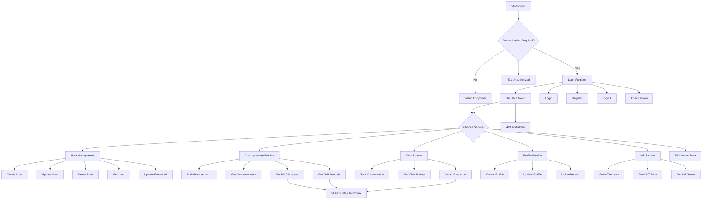

```mermaid
graph TD
    A[Client/User] --> B{Authentication Required?}
    B -->|Yes| C[Login/Register]
    B -->|No| D[Public Endpoints]

    C --> E[Get JWT Token]
    E --> F{Choose Service}
    D --> F

    F --> G[User Management]
    F --> H[Anthropometry Service]
    F --> I[Chat Service]
    F --> J[Profile Service]
    F --> K[IoT Service]

    %% User Management Flow
    G --> G1[Create User]
    G --> G2[Update User]
    G --> G3[Delete User]
    G --> G4[Get User]
    G --> G5[Update Password]

    %% Anthropometry Service Flow
    H --> H1[Add Measurements]
    H --> H2[Get Measurements]
    H --> H3[Get KMS Analysis]
    H --> H4[Get BMI Analysis]

    %% Chat Service Flow
    I --> I1[Start Conversation]
    I --> I2[Get Chat History]
    I --> I3[Get AI Response]

    %% Profile Service Flow
    J --> J1[Create Profile]
    J --> J2[Update Profile]
    J --> J3[Upload Avatar]

    %% IoT Service Flow
    K --> K1[Get IoT Access]
    K --> K2[Send IoT Data]
    K --> K3[Get IoT Status]

    %% Authentication States
    C --> C1[Login]
    C --> C2[Register]
    C --> C3[Logout]
    C --> C4[Check Token]

    %% Response Types
    H3 --> R1[AI Generated Summary]
    H4 --> R1
    I3 --> R1

    %% Error Handling
    B --> E1[401 Unauthorized]
    E --> E2[403 Forbidden]
    F --> E3[500 Server Error]
```
