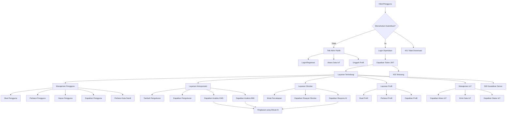

# Dokumentasi API Sistem Backend

## Diagram Alur Sistem



## Daftar Isi

1. [Autentikasi](#autentikasi)
2. [Manajemen Pengguna](#manajemen-pengguna)
3. [Layanan Antropometri](#layanan-antropometri)
4. [Layanan Obrolan](#layanan-obrolan)
5. [Layanan Profil](#layanan-profil)
6. [Layanan IoT](#layanan-iot)

## Penanganan Kesalahan

Semua titik akhir mengikuti format respons kesalahan yang konsisten:

```json
{
  "error": "Deskripsi pesan kesalahan"
}
```

Kode status HTTP umum:

- 400 Permintaan Buruk: Parameter hilang atau tidak valid
- 401 Tidak Diotorisasi: Autentikasi diperlukan atau token tidak valid
- 403 Terlarang: Izin tidak mencukupi
- 404 Tidak Ditemukan: Sumber daya tidak ditemukan
- 500 Kesalahan Server Internal: Kesalahan sisi server

## Header Autentikasi

Untuk titik akhir yang dilindungi, sertakan token JWT di header Otorisasi:

```
Authorization: Bearer <jwt_token>
```
