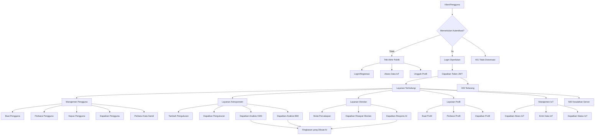

# Dokumentasi API Backend Lengkap

## Diagram Alur Sistem



## Daftar Isi

1. [Autentikasi](#autentikasi)
2. [Manajemen Pengguna](#manajemen-pengguna)
3. [Layanan Antropometri](#layanan-antropometri)
4. [Layanan Obrolan](#layanan-obrolan)
5. [Layanan Profil](#layanan-profil)
6. [Layanan IoT](#layanan-iot)

## Autentikasi

### Login

- **URL**: /api/login
- **Metode**: POST
- **Autentikasi Diperlukan**: Tidak

**Body Permintaan**:

```json
{
  "username": "string",
  "password": "string"
}
```

**Respons**:

```json
{
  "id": "string",
  "username": "string",
  "token": "string",
  "jk": "boolean",
  "tgl_lahir": "string",
  "avatarUrl": "string",
  "nama_lengkap": "string",
  "summary": "string"
}
```

**Kode Status**:

- 200 OK: Login berhasil
- 401 Tidak Diotorisasi: Username atau password salah
- 500 Kesalahan Server Internal: Kesalahan server

### Registrasi

- **URL**: /api/register
- **Metode**: POST
- **Autentikasi Diperlukan**: Tidak

**Body Permintaan**:

```json
{
  "username": "string",
  "password": "string",
  "jk": "boolean",
  "tgl_lahir": "string"
}
```

**Respons**:

```json
{
  "message": "Pengguna dibuat",
  "user": {
    "id": "string",
    "username": "string"
  }
}
```

**Kode Status**:

- 200 OK: Registrasi berhasil
- 401 Tidak Diotorisasi: Pengguna sudah ada
- 500 Kesalahan Server Internal: Gagal mendaftar

### Logout

- **URL**: /api/logout
- **Metode**: POST
- **Autentikasi Diperlukan**: Tidak

**Body Permintaan**:

```json
{
  "token": "string"
}
```

**Respons**:

```json
{
  "message": "Logout berhasil"
}
```

**Kode Status**:

- 200 OK: Logout berhasil
- 401 Tidak Diotorisasi: Token tidak valid
- 500 Kesalahan Server Internal: Gagal logout

## Manajemen Pengguna

### Perbarui Pengguna

- **URL**: /api/user/:id
- **Metode**: PUT
- **Autentikasi Diperlukan**: Ya

**Body Permintaan**:

```json
{
  "username": "string",
  "jk": "boolean",
  "tgl_lahir": "string"
}
```

**Respons**:

```json
{
  "message": "Pengguna berhasil diperbarui",
  "data": {
    "id": "string",
    "username": "string",
    "jk": "boolean",
    "tgl_lahir": "string"
  }
}
```

**Kode Status**:

- 200 OK: Pengguna berhasil diperbarui
- 404 Tidak Ditemukan: Pengguna tidak ditemukan
- 500 Kesalahan Server Internal: Gagal memperbarui pengguna

### Perbarui Kata Sandi

- **URL**: /api/user/password/:id
- **Metode**: PUT
- **Autentikasi Diperlukan**: Ya

**Body Permintaan**:

```json
{
  "oldPassword": "string",
  "newPassword": "string"
}
```

**Respons**:

```json
{
  "message": "Kata sandi berhasil diperbarui"
}
```

**Kode Status**:

- 200 OK: Kata sandi berhasil diperbarui
- 400 Permintaan Buruk: Kata sandi lama salah
- 404 Tidak Ditemukan: Pengguna tidak ditemukan
- 500 Kesalahan Server Internal: Gagal memperbarui kata sandi

### Hapus Pengguna

- **URL**: /api/user/:id
- **Metode**: DELETE
- **Autentikasi Diperlukan**: Ya

**Respons**:

```json
{
  "message": "Pengguna berhasil dihapus"
}
```

**Kode Status**:

- 200 OK: Pengguna berhasil dihapus
- 404 Tidak Ditemukan: Pengguna tidak ditemukan
- 500 Kesalahan Server Internal: Gagal menghapus pengguna

## Layanan Antropometri

### Dapatkan Data Antropometri

- **URL**: /api/antropomerty/list/:id
- **Metode**: GET
- **Autentikasi Diperlukan**: Ya

**Respons**:

```json
{
  "data": [
    {
      "id": "string",
      "height": "string",
      "weight": "string",
      "bmi": "string",
      "kms_bb": "string",
      "kms_tb": "string",
      "age": "number",
      "months": "number",
      "date": "string",
      "notes": "string"
    }
  ]
}
```

**Kode Status**:

- 200 OK: Data berhasil diambil
- 500 Kesalahan Server Internal: Gagal mendapatkan data

### Ekspor Data Antropometri

- **URL**: /api/antropomerty/download/:id
- **Metode**: GET
- **Autentikasi Diperlukan**: Ya

**Respons**:

```json
{
  "message": "File Excel berhasil dibuat",
  "downloadUrl": "string"
}
```

**Kode Status**:

- 200 OK: File Excel berhasil dibuat
- 404 Tidak Ditemukan: Tidak ada data untuk diekspor
- 500 Kesalahan Server Internal: Gagal mengekspor data

## Layanan Obrolan

### Buat Percakapan

- **URL**: /api/groq/conversation
- **Metode**: POST
- **Autentikasi Diperlukan**: Ya

**Body Permintaan**:

```json
{
  "userId": "string",
  "userMessage": "string"
}
```

**Respons**:

```json
{
  "userMessage": "string",
  "AIMessage": "string"
}
```

**Kode Status**:

- 200 OK: Percakapan berhasil dibuat
- 400 Permintaan Buruk: userId dan userMessage wajib
- 500 Kesalahan Server Internal: Kesalahan server internal

### Dapatkan Riwayat Percakapan

- **URL**: /api/groq/conversation
- **Metode**: GET
- **Autentikasi Diperlukan**: Ya

**Respons**:

```json
{
  "data": [
    {
      "id": "string",
      "userId": "string",
      "userMessage": "string",
      "AIMessage": "string",
      "createdAt": "string"
    }
  ]
}
```

**Kode Status**:

- 200 OK: Riwayat percakapan berhasil diambil
- 400 Permintaan Buruk: userId wajib
- 500 Kesalahan Server Internal: Gagal mengambil riwayat percakapan

## Layanan Profil

### Buat/Perbarui Profil

- **URL**: /api/profile
- **Metode**: POST
- **Autentikasi Diperlukan**: Ya
- **Tipe Konten**: multipart/form-data

**Bidang Form**:

- userId (string, wajib): ID Pengguna
- nama_lengkap (string, opsional): Nama lengkap
- summary (string, opsional): Ringkasan profil
- avatar (file, opsional): Gambar profil

**Respons**:

```json
{
  "message": "Profil berhasil diperbarui",
  "data": {
    "id": "string",
    "userId": "string",
    "nama_lengkap": "string",
    "summary": "string",
    "avatarUrl": "string"
  }
}
```

**Kode Status**:

- 200 OK: Profil berhasil dibuat/diperbarui
- 400 Permintaan Buruk: userId wajib
- 500 Kesalahan Server Internal: Gagal membuat/memperbarui profil

### Dapatkan Profil

- **URL**: /api/profile/:userId
- **Metode**: GET
- **Autentikasi Diperlukan**: Ya

**Respons**:

```json
{
  "data": {
    "id": "string",
    "userId": "string",
    "nama_lengkap": "string",
    "summary": "string",
    "avatarUrl": "string"
  }
}
```

**Kode Status**:

- 200 OK: Profil berhasil diambil
- 404 Tidak Ditemukan: Profil tidak ditemukan
- 500 Kesalahan Server Internal: Gagal mengambil profil

## Layanan IoT

### Dapatkan Status IoT

- **URL**: /api/iot/status
- **Metode**: GET
- **Autentikasi Diperlukan**: Ya

**Respons**:

```json
{
  "status": "string",
  "lastSeen": "string",
  "deviceId": "string"
}
```

**Kode Status**:

- 200 OK: Status berhasil diambil
- 404 Tidak Ditemukan: Tidak ada perangkat IoT yang ditemukan
- 500 Kesalahan Server Internal: Gagal mengambil status

### Daftarkan Perangkat IoT

- **URL**: /api/iot/register
- **Metode**: POST
- **Autentikasi Diperlukan**: Ya

**Body Permintaan**:

```json
{
  "userId": "string",
  "deviceId": "string",
  "deviceName": "string"
}
```

**Respons**:

```json
{
  "message": "Perangkat berhasil didaftarkan",
  "data": {
    "id": "string",
    "userId": "string",
    "deviceId": "string",
    "deviceName": "string",
    "status": "string",
    "lastSeen": "string"
  }
}
```

**Kode Status**:

- 200 OK: Perangkat berhasil didaftarkan
- 400 Permintaan Buruk: Bidang wajib hilang
- 409 Konflik: Perangkat sudah terdaftar
- 500 Kesalahan Server Internal: Gagal mendaftarkan perangkat

### Batalkan Pendaftaran Perangkat IoT

- **URL**: /api/iot/unregister/:deviceId
- **Metode**: DELETE
- **Autentikasi Diperlukan**: Ya

**Respons**:

```json
{
  "message": "Perangkat berhasil dibatalkan pendaftarannya"
}
```

**Kode Status**:

- 200 OK: Perangkat berhasil dibatalkan pendaftarannya
- 404 Tidak Ditemukan: Perangkat tidak ditemukan
- 500 Kesalahan Server Internal: Gagal membatalkan pendaftaran perangkat

## Penanganan Kesalahan

### Format Respons Kesalahan Standar

```json
{
  "error": "Deskripsi pesan kesalahan"
}
```

### Kode Status HTTP Umum

- 400 Permintaan Buruk: Parameter hilang atau tidak valid
- 401 Tidak Diotorisasi: Autentikasi diperlukan atau token tidak valid
- 403 Terlarang: Izin tidak mencukupi
- 404 Tidak Ditemukan: Sumber daya tidak ditemukan
- 500 Kesalahan Server Internal: Kesalahan sisi server

## Header Otorisasi

Untuk titik akhir yang dilindungi, sertakan token JWT di header Otorisasi:

```
Authorization: Bearer <jwt_token>
```
